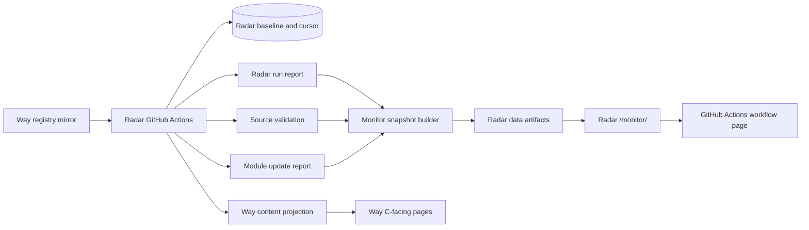

# Radar 独立监控页设计

## 1. 目标

Radar 提供独立的同步监控页面，负责展示 Radar 自己产生的运行工件，并把手动执行入口交给 Radar 仓库的 GitHub Actions。

Way to Agentic 只消费 Radar 发布的内容和报告链接，不再提供 Radar 监控页面、执行接口或本地控制配置。

## 2. 边界

### Radar 负责

- 读取注册表并执行所有同步、基线、翻译和导出任务；
- 通过 GitHub Actions 的定时任务和 `workflow_dispatch` 执行同步；
- 生成运行报告、来源验证、模块更新报告、监控快照和报告索引；
- 将监控工件写入 Radar 仓库的 `data/`；
- 提供独立的 `/monitor/` 页面；
- 页面内跳转到 Radar 的 Actions 页面进行手动执行。

### Way 负责

- 展示 Radar 已发布的内容；
- 在需要时提供一个指向 Radar 监控页的外部链接；
- 不保存、不解释、不触发 Radar 的控制面状态；
- 不提供 `/api/admin/radar/*` 接口。

## 3. Radar 工件

每次 workflow 执行后，Radar 维护以下路径：

- `data/radar-monitor.json`
- `data/radar-run-report.json`
- `data/radar-update-report.json`
- `data/source-validation.json`
- `data/radar-reports/index.json`
- `data/radar-reports/<run-or-date>.json`

监控快照的链接必须指向 Radar 的 `/data/` 路径。翻译内容链接仍然指向 Way 的已发布内容，因为 Way 是 C 端内容投影。

## 4. 手动执行

方案 A 不在前端保存 GitHub Token，也不从浏览器调用 GitHub API。页面只提供：

`/monitor/` -> `https://github.com/WenXiangWu/ai-news-radar/actions/workflows/update-news.yml`

用户在 GitHub Actions 页面中登录后选择 `scope`、`target_id` 并运行 workflow。执行结果和报告由 workflow 写回 Radar 仓库，监控页面按固定间隔重新读取 `data/` 工件。

## 5. 页面

独立页面展示：

- 模块、数据源、适配器和执行计划；
- 最近执行状态、开始时间、结束时间和耗时；
- 数据源可达性、延迟和抓取数量；
- 基线状态、游标和错误；
- DeepSeek、Google Translate 等提供方统计；
- 模块级更新数量、翻译数量和翻译文件链接；
- 历史日报；
- 指向 GitHub Actions 的手动执行入口。

页面不依赖 Way 的 CSS、JavaScript、登录态或 API。

## 6. 数据流

## 7. 验收标准

- Radar 页面只读取 Radar `data/` 工件；
- 页面不包含 Way 路径、Way API 或本地执行接口；
- workflow 成功和失败分支都发布 Radar 监控工件；
- 运行报告、来源验证、更新报告、监控快照和报告索引通过契约校验；
- Way 不存在 Radar 监控页面、Radar 执行接口和 Radar 控制配置；
- Way 只保留指向 `https://news.learnprompt.pro/monitor/` 的外部链接；
- 手动执行入口指向 Radar 的 GitHub Actions workflow；
- 页面 JavaScript 不包含 GitHub Token、DeepSeek Key 或其他密钥。
